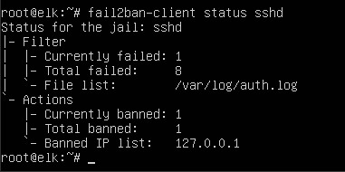
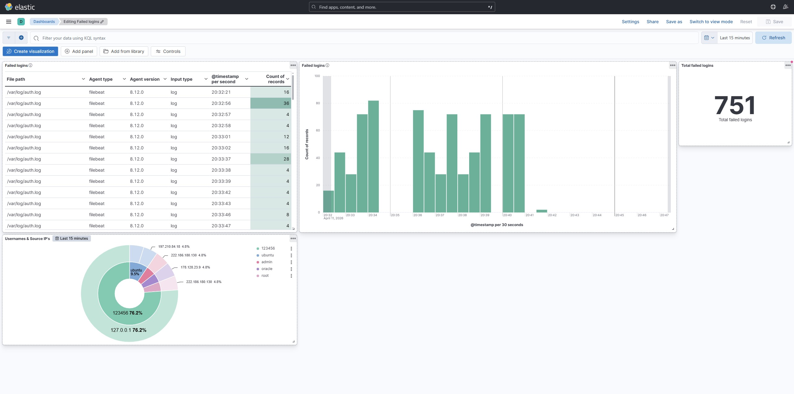
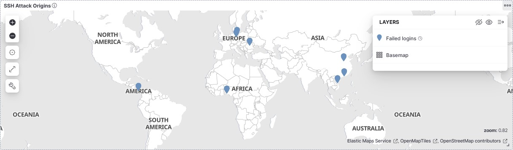
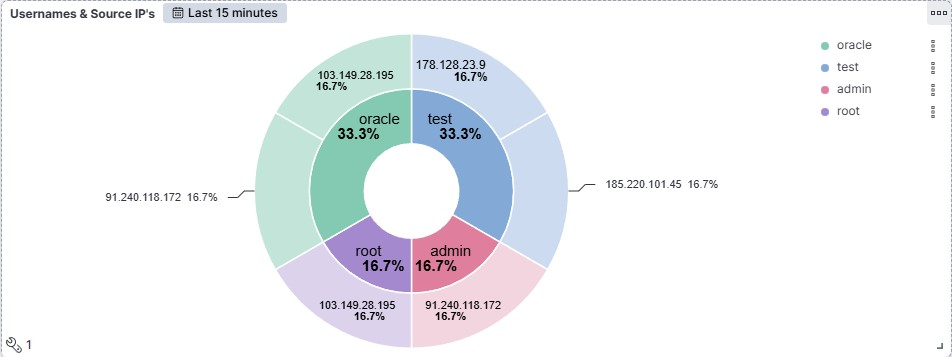
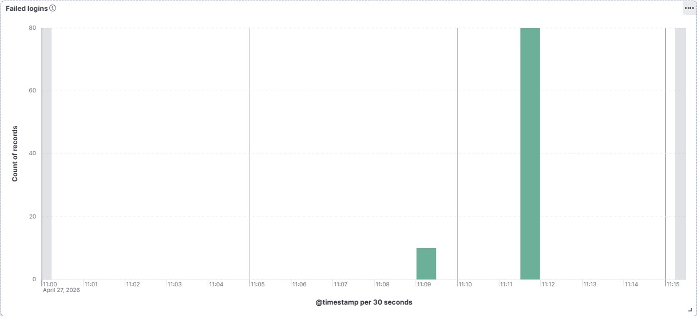
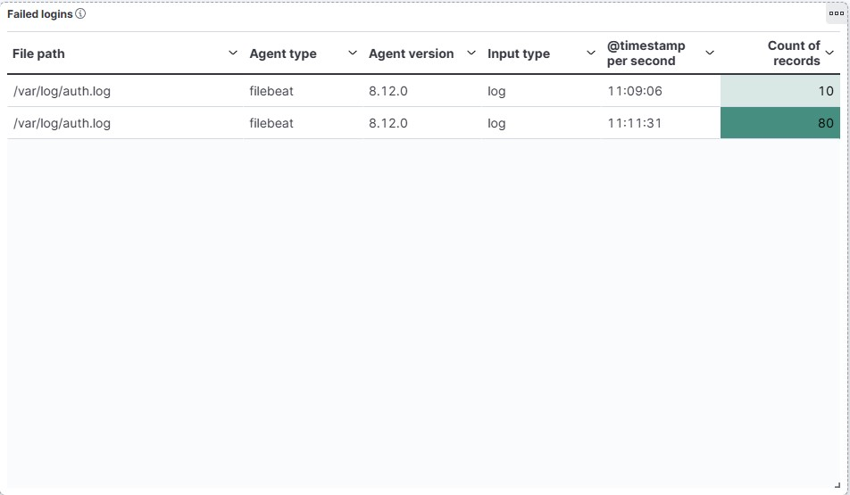
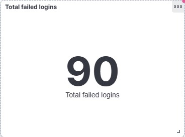
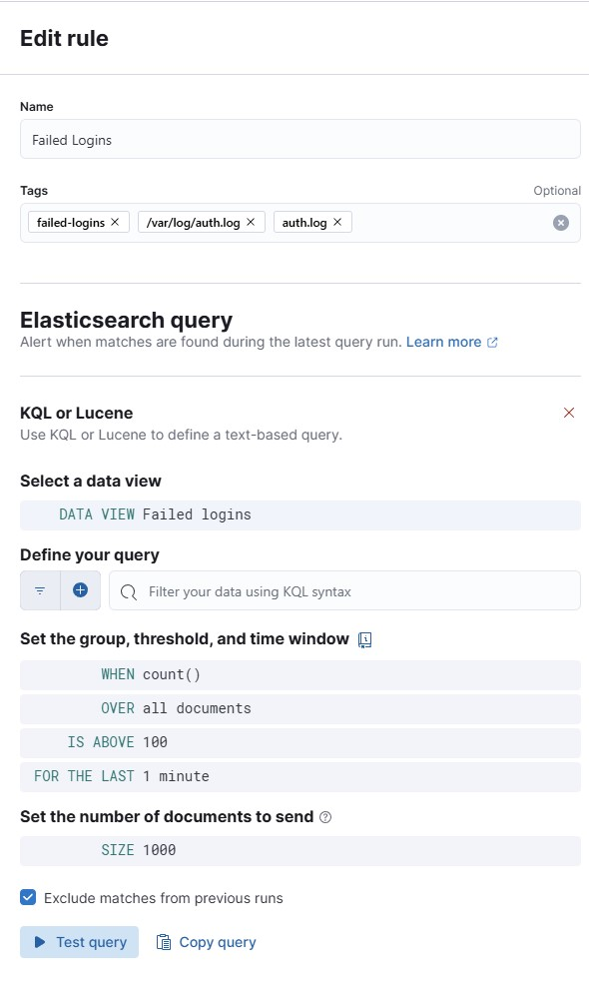

# This project is currently work in progress!

# elk-soc-lab

## ELK Stack SIEM Home Lab

### Short description:

A home lab I built to practice SIEM tools and log analysis.
The ELK stack runs on Docker on an Ubuntu VM, Filebeat collects auth.log events, and I simulate real SSH brute force attacks using Hydra.

### Why I built this:

I'm transitioning into a SOC Analyst role and I believe hands-on experience with these tools is just as important as theoretical knowledge. I have 6 years of Linux admin experience but SIEM and detection engineering is a new area for me that I'm actively developing.

### What the lab includes:

* ELK stack running via Docker Compose
* Filebeat configured to ingest auth.log
* GeoIP enrichment pipeline — IP address to country/city mapping
* SSH brute force simulation using Hydra with a real wordlist
* GeoIP simulation with real public IPs from multiple countries
* Kibana dashboard — failed logins over time, top source IPs, targeted usernames
* SIEM alert rule for brute force detection

### Tech stack:

* Elasticsearch 8.12.0
* Kibana 8.12.0
* Filebeat 8.12.0
* Docker + Docker Compose
* Ubuntu Server 22.04
* Hydra

---

## Investigation

### Scenario:

Multiple failed SSH login attempts were detected on the monitored host.

### Findings:

* High volume of failed login attempts within a short timeframe
* Repeated attempts from the same source IP
* Targeting multiple usernames (including invalid/non-existent users)
* Source IP geolocation shows activity from multiple countries
* Log source: /var/log/auth.log (ingested via Filebeat)

### Detection Logic:

* event.dataset: "system.auth" AND event.outcome: "failure"
* More than 10 failed attempts from a single IP within 1 minute

### Hypothesis:

The activity indicates an automated SSH brute force attack attempting credential guessing.

### Response Actions (Recommended)

* Block malicious IP address using Fail2ban (implemented)
* Disable password-based SSH authentication (recommended)
* Review affected accounts for compromise (recommended)
* Monitor for continued activity or lateral movement (recommended)

### Active Defense (Fail2ban)

Fail2ban was configured to monitor SSH login attempts and automatically block IP addresses after multiple failed login attempts.

* Log source: /var/log/auth.log
* Action: IP ban after repeated failures

### Fail2ban status
```bash
root@elk:~/phishing-lab# systemctl status fail2ban
● fail2ban.service - Fail2Ban Service
     Loaded: loaded (/lib/systemd/system/fail2ban.service; disabled; vendor preset: enabled)
     Active: active (running) since Mon 2026-04-27 12:46:46 UTC; 1min 55s ago
       Docs: man:fail2ban(1)
   Main PID: 6780 (fail2ban-server)
      Tasks: 5 (limit: 4554)
     Memory: 13.0M
        CPU: 126ms
     CGroup: /system.slice/fail2ban.service
             └─6780 /usr/bin/python3 /usr/bin/fail2ban-server -xf start

Apr 27 12:46:46 elk systemd[1]: Started Fail2Ban Service.
Apr 27 12:46:46 elk fail2ban-server[6780]: Server ready
```
### Fail2ban-client status
```bash
  root@elk:~/phishing-lab# sudo fail2ban-client status sshd
Status for the jail: sshd
|- Filter
|  |- Currently failed: 0
|  |- Total failed:     0
|  `- File list:        /var/log/auth.log
`- Actions
   |- Currently banned: 0
   |- Total banned:     0
   `- Banned IP list:
   ```
### Active Defense (Fail2ban)

Fail2ban was configured to monitor SSH authentication logs and automatically block IP addresses after repeated failed login attempts.

* Log source: `/var/log/auth.log`
* Detection: Multiple failed SSH login attempts within a short time window
* Action: Automatic IP ban after exceeding threshold

### Configuration

```ini
[sshd]
enabled = true
port = ssh
logpath = /var/log/auth.log
backend = auto
maxretry = 3
findtime = 60
bantime = 600
ignoreip =
ignoreself = false
```

### Verification

A brute force attack was simulated locally using repeated failed SSH login attempts.
Fail2ban successfully detected the activity and banned the attacking IP.

```bash
sudo fail2ban-client status sshd
```

Example output:

```text
Status for the jail: sshd
|- Filter
|  |- Currently failed: 1
|  |- Total failed:     8
|  `- File list:        /var/log/auth.log
`- Actions
   |- Currently banned: 1
   |- Total banned:     1
   `- Banned IP list:   127.0.0.1
```

### Screenshot



---

## MITRE ATT&CK Mapping

* T1110 — Brute Force
* T1078 — Valid Accounts (potential risk if attack succeeds)
* T1021.004 — Remote Services: SSH

---

### Detection Rules:

* **SSH Brute Force** — Triggers when more than 10 failed login attempts occur from the same IP within 1 minute
* **Invalid User Login Attempts** — Detects repeated login attempts using non-existent usernames
* **Geographic Anomaly** — Flags login attempts originating from high-risk countries

### How to run:

```bash id="1k4o2g"
git clone https://github.com/bluemzi/elk-soc-lab.git
cd elk-soc-lab
./scripts/elk.sh
```

### What I learned:

* How to ingest and normalize Linux authentication logs into Elasticsearch
* How Elasticsearch ingest pipelines and GeoIP enrichment work in practice
* Writing KQL queries in Kibana for threat detection
* Creating detection rules based on thresholds and event patterns
* Recognizing SSH brute force attack behavior in log data
* Understanding how attackers target both valid and non-existent usernames
* How SIEM supports real SOC workflows (detection → investigation → response)

## Screenshots

### Dashboard



### SSH Attack Origins

Visualizes the geographic origin of SSH brute force attempts based on GeoIP enrichment of source IP addresses ingested from /var/log/auth.log.


### Usernames & Source IPs



### Failed logins with timestamps



### Failed logins — file source

Filebeat 8.12.0 was used to collect data from /var/log/auth.log


### Total failed logins detected



## Detection Rule


